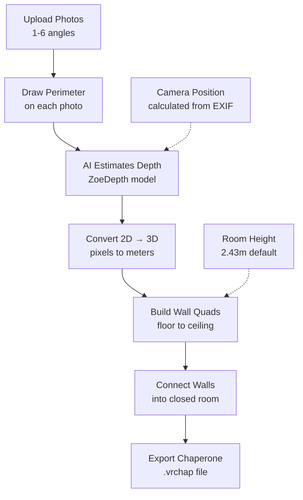

# SteamVR Room Perimeter Mapper

A web-based tool for creating accurate SteamVR chaperone bounds by drawing room perimeters on photos and interpolating across multiple camera angles.

## Features

- **Multi-photo upload**: Upload 1-6 photos from different room angles
- **Interactive perimeter drawing**: Click to place perimeter points on each photo
- **2D-to-3D projection**: Uses ZoeDepth for depth estimation
- **Multi-view interpolation**: Combines annotations from all photos
- **3D preview**: Visualize the room before exporting
- **Direct SteamVR integration**: Auto-detects config and applies chaperone bounds

## Architecture

```
steamvr-room-mapper/
├── frontend/          # React + TypeScript + Three.js + TailwindCSS
│   ├── src/
│   │   ├── components/
│   │   │   ├── PhotoUpload.tsx       # Multi-file upload with drag-drop
│   │   │   ├── PerimeterEditor.tsx   # 2D canvas for drawing perimeters
│   │   │   ├── RoomPreview.tsx       # 3D Three.js visualization
│   │   │   └── ChaperoneExport.tsx   # SteamVR config generation
│   │   ├── types/
│   │   └── App.tsx
│   └── package.json
├── backend/           # Python FastAPI
│   ├── app/
│   │   ├── api/       # REST API endpoints
│   │   ├── models/    # Pydantic schemas
│   │   └── services/
│   │       ├── depth_estimation.py   # ZoeDepth integration
│   │       ├── multi_view.py         # Multi-view geometry
│   │       └── chaperone_generator.py # SteamVR config generation
│   └── requirements.txt
└── README.md
```

## Quick Start

### Prerequisites

- Node.js 18+
- Python 3.10+
- SteamVR installed at `C:\Program Files (x86)\Steam\`

### Frontend Setup

```bash
cd frontend
npm install
npm run dev
```

Frontend runs at `http://localhost:5173`

### Backend Setup

```bash
cd backend
python -m venv venv
venv\Scripts\activate
pip install -r requirements.txt
python -m app.main
```

Backend runs at `http://localhost:8000`

### SteamVR Config Path

The application auto-detects SteamVR at:
```
C:\Program Files (x86)\Steam\config\chaperone_info.vrchap
```

## Workflow

1. **Upload Photos**: Drag 1-6 photos of your room (different angles recommended)
2. **Draw Perimeters**: On each photo, click around the room edges to place points
3. **Generate Preview**: Backend processes depth and interpolates from all views
4. **Export**: Download `.vrchap` file or apply directly to SteamVR

## Technical Details

### Chaperone Format (v5)

The generated `chaperone_info.vrchap` matches SteamVR's schema:

```json
{
  "version": 5,
  "universes": [{
    "collision_bounds": [
      [[x1,y1,z1], [x2,y2,z2], [x3,y3,z3], [x4,y4,z4]],  // Wall quad
      ...
    ],
    "play_area": [width, depth],
    "seated": {"translation": [x,y,z], "yaw": 0},
    "standing": {"translation": [x,y,z], "yaw": 0},
    "time": "ISO timestamp",
    "universeID": "unique_id"
  }]
}
```

### Depth Estimation

Uses [ZoeDepth](https://github.com/isl-org/ZoeDepth) for metric depth prediction:
- Converts 2D pixel coordinates to 3D meters using depth map
- Accounts for camera intrinsics (focal length from EXIF)
- Projects points to floor plane (y=0)

### Multi-View Geometry

When multiple photos provided:
1. Estimates camera poses from feature matching
2. Triangulates corresponding points via ray intersection
3. Clusters and averages nearby points from different views
4. Applies Laplacian smoothing for clean edges

### How Room Dimensions Are Calculated



**Key Steps Explained:**
- **Depth Estimation**: AI predicts distance from camera to each wall point
- **3D Projection**: Combines pixel position + depth + camera angle to get real-world coordinates
- **Wall Building**: Each wall segment becomes a vertical quad from floor (y=0) to ceiling (y=2.43m)
- **Closed Room**: Walls must form a complete loop - last point connects back to first

## Development

### Frontend Lint Errors

TypeScript/React lint errors are expected before `npm install` - they're resolved once dependencies are installed.

### Adding New Features

1. **New Vision Model**: Add service in `backend/app/services/`
2. **New UI Component**: Add to `frontend/src/components/`
3. **API Changes**: Update `backend/app/models/schemas.py`

## License

MIT
